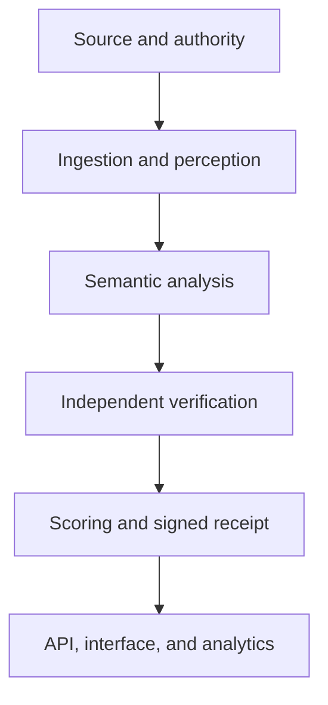

# AgentView Architecture

AgentView is organized into six major layers that carry data from authorized source intake through signed receipt publication and analytics.



## 1. Source and authority layer

| Component | Function | Output |
| --- | --- | --- |
| Source Registry | Registers videos, transcripts, audio, captions, and external references | Immutable source ID and revision |
| Asset Store | Holds authorized media, transcripts, frames, and evidence | SHA-256-addressed objects |
| Rights Registry | Records ownership, license, public-domain status, or creator authorization | Authority grant |
| Policy Guard | Determines which modalities the agent may process | Allow, deny, or restricted decision |
| YouTube Connector | Retrieves permitted metadata, displays the native player, and imports owner-authorized captions | YouTube reference or authorized caption asset |

A public YouTube URL alone provides metadata and human-controlled playback. Autonomous audiovisual analysis requires separately authorized media or captions.

## 2. Identity and objective layer

| Component | Function | Output |
| --- | --- | --- |
| User and Organization Identity | Authenticates operators and isolates organizations | OIDC identity and tenant |
| Role-Based Access Control | Controls uploads, jobs, evidence, agents, keys, and audits | Authorized action |
| Agent Registry | Gives every viewing agent a persistent identity and public key | Agent ID |
| Agent Version Registry | Freezes model, prompts, tools, schemas, budgets, and policies | Immutable agent version |
| Objective Registry | Defines what the agent must accomplish | Versioned objective |
| Rubric Registry | Defines how content merit is evaluated | Versioned evaluation rubric |

An agent version changes whenever its model, prompt, tool permissions, scoring policy, or verification rules change.

## 3. Ingestion and perception layer

| Component | Function | Output |
| --- | --- | --- |
| Upload Service | Accepts authorized media with size and checksum controls | Validated upload |
| Integrity Scanner | Checks MIME signature, hash, duration, streams, corruption, and malware | Integrity decision |
| Media Processor | Uses FFmpeg/ffprobe to inspect and normalize authorized media | Stream and duration map |
| Audio Processor | Extracts bounded analysis audio from authorized assets | Timestamped audio chunks |
| Transcription Engine | Converts speech to timestamped text | Transcript segments |
| Caption Parser | Parses VTT, SRT, TTML, SBV, and plain text | Normalized captions |
| Visual Sampler | Detects scenes and samples representative frames | Timestamped frame evidence |
| Temporal Segmenter | Divides content into coherent 30-120 second sections | Evidence segments |
| Evidence Store | Preserves observations and their exact source locations | Evidence bundle |

The perception layer must record what was actually examined. It cannot claim that an unsampled frame was observed.

## 4. Semantic intelligence layer

| Component | Function | Output |
| --- | --- | --- |
| Segment Analyst | Interprets each temporal segment independently | Segment observations |
| Entity Extractor | Identifies people, objects, organizations, places, and concepts | Entity records |
| Relationship Mapper | Connects entities through actions, ownership, causality, and chronology | Relationship graph |
| Claim Extractor | Converts statements into normalized propositions | Evidence-linked claims |
| Topic Mapper | Builds hierarchical topics and semantic connections | Topic graph |
| Synthesis Agent | Combines segment results into the requested outcome | Summary, answers, comparison, or plan |

Every material conclusion must reference an observation or claim. Video or transcript instructions are treated as untrusted content and cannot modify the agent’s permissions.

### Supported objectives

- Comprehensive summary
- Question answering
- Claim inventory
- Instruction extraction
- Video comparison
- Topic mapping
- Content-merit evaluation
- Evidence-grounded action plan

## 5. Verification and scoring layer

| Component | Function | Output |
| --- | --- | --- |
| Independent Verifier | Checks analysis against cited evidence | Verification report |
| Contradiction Detector | Finds claims that conflict with evidence or each other | Contradiction scores |
| Coverage Calculator | Measures how much of each required modality was processed | Coverage score |
| Comprehension Evaluator | Tests factual, relational, temporal, causal, uncertainty, and objective understanding | Comprehension score |
| Outcome Validator | Confirms required output fields and evidence links | Valid or invalid outcome |
| Qualification Engine | Applies deterministic thresholds | Qualified or unqualified Agent View |
| Content Merit Council | Uses three independent evaluations to judge content quality | Content Merit Score |

The Viewing Confidence Score is:

```text
VCS = 100(0.30C + 0.30E + 0.25K + 0.10S + 0.05O)
```

Where:

- `C`: coverage
- `E`: evidence alignment
- `K`: comprehension
- `S`: consistency
- `O`: objective completion

A Qualified Agent View requires:

- authorized source
- at least 80% required coverage
- at least 90% evidence alignment
- at least 75% comprehension
- at least 90% consistency
- completed objective
- total VCS of at least 82
- no critical verification error

## 6. Receipt and analytics layer

| Component | Function | Output |
| --- | --- | --- |
| Canonicalizer | Converts receipt data into deterministic RFC 8785 JSON | Canonical payload |
| Claims Merkle Builder | Creates a cryptographic root for all verified claims | Merkle root |
| Deduplication Engine | Prevents identical retries from becoming additional views | Logical Agent View key |
| Receipt Signer | Signs the canonical payload with Ed25519 | Signed Agent View receipt |
| Receipt Verifier | Independently checks schema, hashes, signature, and key status | Verification result |
| Metrics Aggregator | Counts executions, Agent Views, QAVs, unique agents, classes, and objectives | AgentView analytics |
| Key Registry | Publishes active, rotated, and revoked public signing keys | Verification-key document |

The signed receipt identifies:

- agent and version
- source and exact revision
- authority grant
- viewing objective
- evidence coverage
- claims Merkle root
- comprehension scores
- qualification result
- outcome hash
- timestamp and signature

## Execution and application layer

| Component | Technology | Responsibility |
| --- | --- | --- |
| Workflow Orchestrator | Temporal | Durable jobs, retries, cancellation, and recovery |
| Scheduler | Temporal schedules | Authorized autonomous collections |
| Control API | FastAPI | Sources, agents, jobs, outcomes, receipts, and metrics |
| Web Application | React/TypeScript | Uploads, job monitoring, evidence, receipts, and analytics |
| Event Stream | Server-Sent Events | Live job-stage updates |
| Transactional Outbox | PostgreSQL | Reliable publication of completion events |
| Cache and Rate Limits | Redis | Limits, locks, and short-lived state |
| Primary Database | PostgreSQL/pgvector | Identities, sources, evidence, jobs, claims, and receipts |
| Object Storage | S3/MinIO | Authorized media and evidence artifacts |

## Security and operations layer

Required supporting components:

- OIDC authentication
- Database tenant isolation
- Encrypted OAuth tokens
- Isolated media-processing containers
- Prompt-injection protection
- Secret redaction
- Audit logging
- Data-retention and deletion workflows
- OpenTelemetry tracing
- Prometheus metrics
- Backup and recovery
- Policy and security tests
- Dependency and container scanning

## Core data contracts

The system should pass six immutable objects between stages:

```text
SourcePackage -> PolicyDecision -> EvidenceBundle -> SemanticAnalysis -> VerificationReport -> SignedAgentViewReceipt
```

That separation is essential. The AI cannot grant itself permission, modify its evidence, calculate its own final score, or sign its own unverified conclusions.

