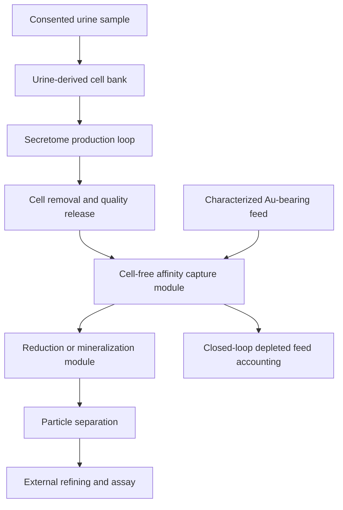

# AURUM

**Au Recovery Using Molecular secretomes**  
A research architecture for a urine-derived-cell, cell-free gold-recovery biorefinery.

> [!IMPORTANT]
> AURUM does **not** claim that urine, stem cells, or microorganisms create gold atoms.
> Gold has atomic number 79; making it from another element requires a nuclear reaction.
> This project investigates whether molecules produced by cultured urine-derived human cells
> could selectively capture and help mineralize **pre-existing ionic gold** from a separately
> supplied gold-bearing feed.

## The concept

Viable progenitor-like cells can be recovered noninvasively from human urine and expanded in
culture. Separately, biological gold cycling is established in certain microbes: secreted
metabolites or cellular detoxification systems can bind soluble gold complexes and promote
formation of elemental gold particles. AURUM joins those two observations as a deliberately
testable hypothesis:

> Can a urine-derived human-cell platform be engineered to manufacture a reusable, cell-free
> molecular capture phase that selectively recovers dissolved gold while the living culture
> remains isolated from the hazardous metal feed?

No published evidence presently demonstrates that urine-derived human cells perform this full
function. That gap is the research question, not a hidden assumption.

## System boundary



The defining safety feature is **physical separation**: living human cells do not contact
e-waste leachate, mine water, or other toxic process feed. Only a qualified cell-free product
enters the capture module.

## What is established versus proposed

| Statement | Status | Repository treatment |
|---|---|---|
| Human urine can provide expandable urine-derived cells | Supported in published literature | Foundational observation |
| Certain microbes can transform dissolved gold complexes into particles | Supported in published literature | Biological precedent |
| Biology can create gold atoms from non-gold elements | False under ordinary biochemistry | Explicitly excluded |
| Urine is itself an economically meaningful gold ore | Not established here | Not assumed |
| Urine-derived human cells naturally recover gold | Not demonstrated | Falsifiable hypothesis |
| Engineered urine-derived cells can produce a useful gold-binding secretome | Not demonstrated | Core research hypothesis |
| A cell-free two-loop process can be economical | Not demonstrated | Modeled only from declared assumptions |

See [Claims and evidence](docs/CLAIMS_AND_EVIDENCE.md) for the complete evidence ledger.

## Repository deliverables

- A complete conceptual process architecture with biological and industrial loops separated.
- A deterministic Python model that accounts for every milligram of gold through accessibility,
  affinity capture, reduction, harvesting, and refining.
- Secretome binding-capacity and reuse-decay constraints.
- Campaign-scale energy and screening economics with no hidden defaults.
- A strict JSON scenario schema and machine-readable results.
- A sensitivity-grid command for concentration and affinity hypotheses.
- Research gates, negative controls, falsification criteria, safety boundaries, regulatory map,
  and an invention-disclosure framework.
- Automated linting, tests, coverage enforcement, and package builds in GitHub Actions.

## Install and run

The runtime model has no third-party dependencies and requires Python 3.11 or newer.

```bash
python -m venv .venv
. .venv/bin/activate
python -m pip install -e ".[dev]"
aurum validate examples/reference_scenario.json
aurum run examples/reference_scenario.json --pretty
```

Run a sensitivity grid:

```bash
aurum sensitivity examples/reference_scenario.json \
  --concentration-mg-l 0.001 0.01 0.1 1 \
  --affinity 0.25 0.50 0.75 0.95 \
  --pretty \
  --output sensitivity.json
```

Run quality checks:

```bash
python -m ruff check .
python -m pytest --cov=aurum_biorefinery --cov-report=term-missing
python -m build
```

## Model guarantees

For a feed batch with volume \(V\), assayed gold concentration \(C\), and accessible fraction
\(f_a\), input and accessible gold are:

\[
m_{in}=VC, \qquad m_{accessible}=m_{in}f_a
\]

Capture is bounded by both affinity and physical secretome capacity:

\[
m_{captured}=\min(m_{accessible}f_c,\;V_s q_s f_s r^n)
\]

where \(V_s\) is capture-phase volume, \(q_s\) is measured binding capacity, \(f_s\) is active
fraction, \(r\) is per-reuse capacity retention, and \(n\) is the zero-based reuse index.
Downstream recovery is:

\[
m_{refined}=m_{captured}f_r f_h f_p
\]

The implementation rejects negative, nonfinite, out-of-range, missing, and unknown inputs. It
uses decimal arithmetic and asserts:

\[
m_{in}=m_{inaccessible}+m_{uncaptured}+m_{unreduced}+m_{harvest\ loss}
+m_{refining\ loss}+m_{refined}
\]

There is intentionally no `gold_created` term.

## Validation gates

The project advances only when evidence passes explicit gates:

1. **Analytical validity:** blanks, spikes, certified reference materials, and total mass balance
   exclude contamination and instrument artifacts.
2. **Biological attribution:** conditioned medium outperforms matched unconditioned medium and
   the activity follows the candidate molecular fraction.
3. **Selectivity:** recovery is quantified in the presence of realistic competing ions.
4. **Conversion:** spectroscopy or diffraction distinguishes elemental Au(0) from adsorbed ionic
   complexes.
5. **Reusability:** capacity retention is measured across predetermined cycles.
6. **Process viability:** independently measured recovery, energy, consumables, and waste data
   replace hypothesis inputs before any economic claim.

Detailed gates are in [Validation plan](docs/VALIDATION_PLAN.md).

## Documentation

- [Scientific basis](docs/SCIENTIFIC_BASIS.md)
- [System architecture](docs/SYSTEM_ARCHITECTURE.md)
- [Claims and evidence](docs/CLAIMS_AND_EVIDENCE.md)
- [Validation plan](docs/VALIDATION_PLAN.md)
- [Techno-economic model](docs/TECHNO_ECONOMICS.md)
- [Safety, ethics, and containment](docs/SAFETY_ETHICS.md)
- [Regulatory map](docs/REGULATORY_MAP.md)
- [Invention disclosure](docs/INVENTION_DISCLOSURE.md)
- [Roadmap](docs/ROADMAP.md)

## Foundational references

1. Zhou T, et al. *Generation of human induced pluripotent stem cells from urine samples.*
   Nature Protocols. 2012;7:2080–2089. [doi:10.1038/nprot.2012.115](https://doi.org/10.1038/nprot.2012.115)
2. Bharadwaj S, et al. *Multipotential differentiation of human urine-derived stem cells.*
   Stem Cells. 2013;31:1840–1856. [doi:10.1002/stem.1424](https://doi.org/10.1002/stem.1424)
3. Reith F, et al. *Mechanisms of gold biomineralization in the bacterium Cupriavidus
   metallidurans.* PNAS. 2009;106:17757–17762.
   [doi:10.1073/pnas.0904583106](https://doi.org/10.1073/pnas.0904583106)
4. Johnston CW, et al. *Gold biomineralization by a metallophore from a gold-associated
   microbe.* Nature Chemical Biology. 2013;9:241–243.
   [doi:10.1038/nchembio.1179](https://doi.org/10.1038/nchembio.1179)
5. Bohu T, et al. *Evidence for fungi and gold redox interaction under Earth surface
   conditions.* Nature Communications. 2019;10:2290.
   [doi:10.1038/s41467-019-10006-5](https://doi.org/10.1038/s41467-019-10006-5)

These sources support the separate biological precedents. They do not validate the integrated
AURUM process.

## Ownership and permitted use

Concept and system architecture: **Nine 1 Eight / 918 Technologies**, 2026. This repository is
distributed under the included proprietary evaluation license. No patent license is granted.
The invention disclosure is a technical record, not legal advice or a patentability opinion.

